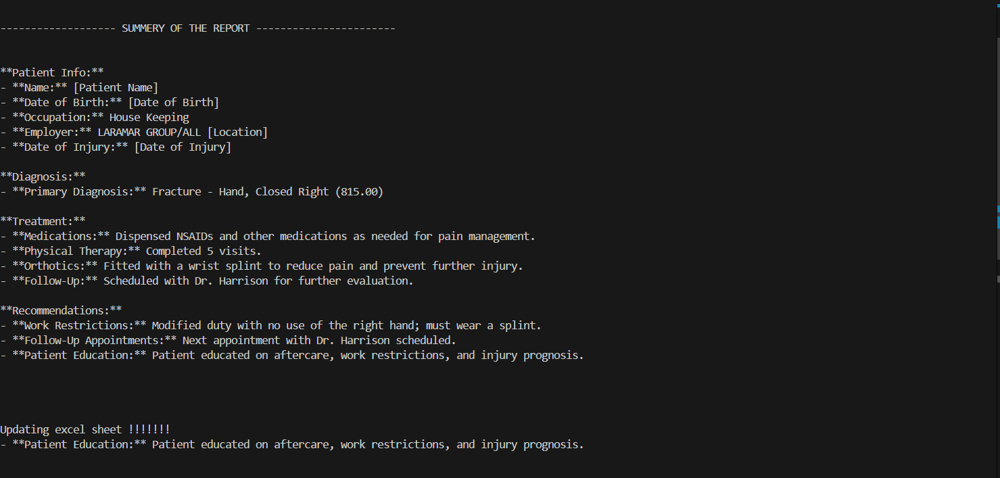

# Medical Data Summarizer

## Overview

The **Medical Data Summarizer** is a Python-based tool designed to process medical reports in PDF format. It performs Optical Character Recognition (OCR) on flattened PDFs, anonymizes sensitive Personally Identifiable Information (PII), and generates structured summaries using an AWS Bedrock-powered Large Language Model (LLM). The summarized report is then stored in an Excel sheet for easy reference.

## Features

- **PDF Processing:** Converts non-searchable (flattened) PDFs into searchable PDFs using OCR.
- **Anonymization:** Utilizes **Presidio Anonymizer** to remove sensitive patient information.
- **Summarization:** Uses **LangChain** with AWS Bedrock's LLM to generate structured summaries.
- **Data Storage:** Saves the full anonymized report and summary into an Excel sheet for tracking.

---

## **Technologies Used**

### **1. Optical Character Recognition (OCR)**

- **Libraries Used:** `pytesseract`, `pdf2image`, `PyPDF2`
- **Approach:**
  - Converts PDF pages to images using `pdf2image`.
  - Extracts text from images using `pytesseract`.
  - Reconstructs a new searchable PDF with extracted text.

### **2. PII Anonymization**

- **Library Used:** `Presidio Anonymizer`
- **Approach:**
  - Detects sensitive information such as **names, dates, account numbers, and phone numbers**.
  - Replaces detected entities with placeholders (e.g., `<PERSON>`, `<DATE_TIME>`).

### **3. Medical Report Summarization**

- **Libraries Used:** `LangChain`, `boto3`, `AWS Bedrock`
- **Approach:**
  - Loads the medical report as LangChain documents.
  - Uses AWS Bedrock LLM (`amazon.nova-micro-v1:0`) to extract structured information.
  - Generates a concise summary with key details such as patient information, diagnosis, treatment, and recommendations.

### **4. Data Storage & Logging**

- **Libraries Used:** `openpyxl`
- **Approach:**
  - Saves the **full anonymized report** and its **summary** into an Excel sheet.
  - Ensures data persistence and easy access for further analysis.

---

## **Project Workflow**

1. **Check if the PDF is Flattened:**
   - If `is_pdf_flattened()` returns `True`, the PDF is converted to a searchable format.
   - The new searchable PDF is saved as `output_searchable.pdf`.
2. **Anonymization of Medical Report:**
   - Extracted text is analyzed using Presidio.
   - PII is replaced with placeholders.
3. **Summarization using AWS Bedrock LLM:**
   - The anonymized text is sent to AWS Bedrock.
   - A structured summary is generated.
4. **Data Storage:**
   - The anonymized full report and its summary are saved in an Excel sheet.

---

## **Installation & Setup**

### **1. Install Dependencies**

Ensure you have Python installed. Then install the required libraries:

```sh
pip install langchain boto3 presidio-analyzer presidio-anonymizer openpyxl pytesseract pdf2image PyPDF2
```

### **2. Configure AWS Credentials**

Set up AWS credentials in your `.env` file:

```env
AWS_ACCESS_KEY_ID=your-access-key
AWS_SECRET_ACCESS_KEY=your-secret-key
AWS_REGION=your-region
```

### **3. Set Up Tesseract OCR**

- Download and install **Tesseract OCR** from [here](https://github.com/tesseract-ocr/tesseract).
- Update the path in the script:

```python
pytesseract.pytesseract.tesseract_cmd = r'C:\Program Files\Tesseract-OCR\tesseract.exe'
```

---

## **Usage**

Run the script on a PDF medical report:

```sh
python main.py
```

---

## **Example Output**

```plaintext
------------------- SUMMARY OF THE REPORT -----------------------

1. **Patient Info**
- Name: <PERSON>
- Date of Birth: <DATE_TIME>
- Work Status: Modified duty

2. **Diagnosis**
- Fracture - Hand, Closed Right (815.00)

3. **Treatment**
- Physical Therapy
- Wrist splint application

4. **Recommendations**
- Follow-up with Dr. Harrison

Updating excel sheet !!!!!!
Excel sheet updated successfully at medical_reports.xlsx
```

---

## **Screenshots**




---

## **Future Enhancements**

- **Integration with a Database:** Store reports in a structured database instead of Excel.
- **Improved NLP Processing:** Enhance LLM prompts for more structured outputs.
- **Web API Support:** Convert this tool into a REST API for broader usage.

---

## **License**

MIT License. Free to use and modify.

---

Feel free to contribute to this project! 🚀
